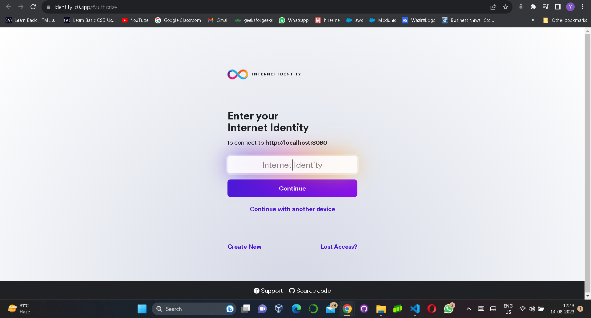
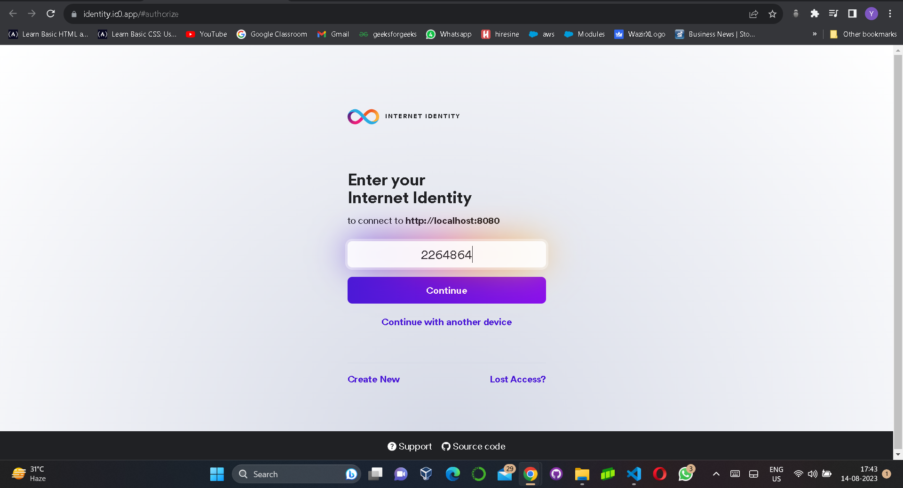
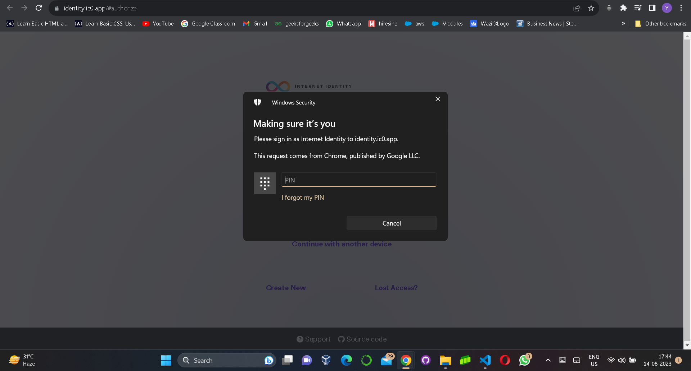
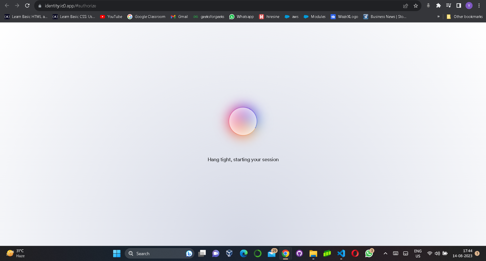
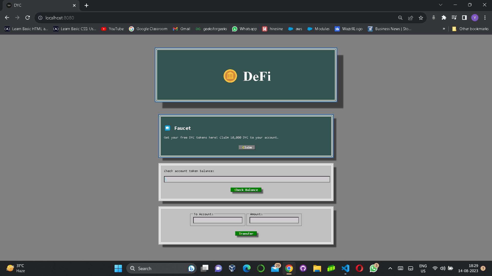

# Decentralized Token Project - DYC

Welcome to the Decentralized Token Project - DYC repository! This project is designed to showcase the implementation of a decentralized token called "DYC" on the Internet Computer Protocol (ICP) blockchain platform. The token allows users to claim, manage, and transfer DYC tokens within a secure and decentralized ecosystem.

## Features
- Claim 10,000 free DYC tokens.
- Check token balances easily.
- Facilitate secure token transfers to other users.

## Functionalities

### 1. Claim Free DYC Tokens
Users have the ability to claim 10,000 free DYC tokens. This is designed to attract initial users and encourage them to explore the project.

### 2. Check Token Balances
Through a user-friendly interface, users can easily check their DYC token balances. This transparency feature ensures users have a clear overview of their holdings.

### 3. Token Transfer
Facilitate secure and seamless transfers of DYC tokens to other users within the DYC ecosystem. This feature enables users to engage in transactions directly from the interface.

## Getting Started
Provide a brief overview of what the project does and how users can benefit from it. Include any prerequisites or requirements they need to have before getting started.

## Technologies Used
- Internet Computer Protocol (ICP)
- Motoko Programming Language
- React (Frontend)
- Other relevant technologies

## Installation
1. Clone the repository: `git clone https://github.com/yourusername/dyc-project.git`
2. Navigate to the project directory: `cd dyc-project`
3. Install dependencies: `npm install`

## Usage
1. Start the frontend: `npm start`
2. Interact with the DYC token functionalities through the user interface.
3. Explore the token claim, balance check, and transfer features.

---

Feel free to explore the project and contribute to its development. If you have any questions, concerns, or feedback, please don't hesitate to [get in touch](mailto:yash.chauhan.yc@outlook.com).
